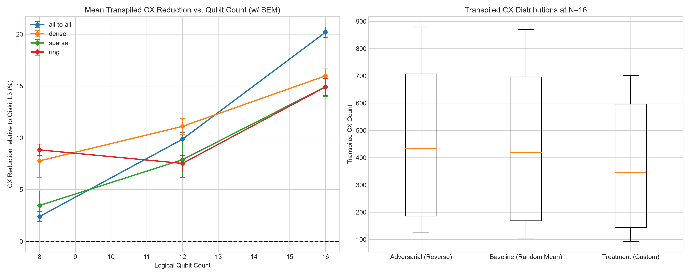

# QAOA Hardware-Aware Routing Benchmark

A heuristic pre-compiler and rigorous empirical benchmark demonstrating how hardware-aware distance sorting of commuting $ZZ$-interactions can significantly reduce transpilation overhead on IBM's Heavy-Hex architecture.

## 📌 The Problem
When compiling dense Quantum Approximate Optimization Algorithm (QAOA) circuits, general-purpose compilers (like Qiskit's SABRE router at `optimization_level=3`) often face a combinatorial explosion. Because they do not natively reorder commuting interactions based on hardware topology by default, they inject a massive amount of unnecessary `SWAP` gates, increasing both noise (CX count) and decoherence (Circuit Depth).

## 💡 The Solution
Since $ZZ(\theta)$ terms in QAOA commute, they can be executed in any order. This project implements a **Greedy Hardware-Distance Sorter** that queries the target `CouplingMap` (IBM Heavy-Hex) and orders the interactions based on the shortest physical path. 

By pre-organizing the circuit *before* passing it to Qiskit Level 3, we prevent the router from making inefficient global swapping decisions.

## 🔬 Rigorous Benchmark (V2)
This repository includes a strict benchmark script (`qaoa_routing_benchmark_v2.py`) designed with academic rigor:
* **Target:** Faithful 19-qubit Heavy-Hex backend simulation.
* **Scaling:** Evaluated from 8 to 16 qubits across 4 topologies (All-to-All, Dense, Sparse, Ring).
* **Baselines:** Compared against multiple random orderings (averaged) and an adversarial reverse-distance control.
* **Verification:** Exact unitary matrix equivalence checking (for $N \le 10$).
* **Statistics:** Wilcoxon signed-rank testing, Holm-Bonferroni correction for multiple comparisons, and 95% Bootstrap Confidence Intervals.

## 📊 Results & Scaling Analysis



**Key Findings:**
1. **Combinatorial Explosion Avoided:** On 16-qubit dense/all-to-all topologies, the pre-compiler achieved a **~20% reduction** in both Transpiled CX operations and Circuit Depth.
2. **Statistical Significance:** The improvement is highly stable. Across heavy configurations, the Wilcoxon/Holm corrected p-values were `< 0.0001` with a **100% win rate** over the baseline.
3. **Topological Variance:** While dense graphs show exponential improvement, highly structured sparse topologies (like Rings) show diminishing returns at scale due to geometric embedding limits on the Heavy-Hex lattice.

## 🚀 How to Run
Requirements: `pip install qiskit numpy pandas scipy matplotlib`

Run the benchmark (Standard mode generates the plots and CSVs):
```bash
python qaoa_routing_benchmark_v2.py --mode standard
👨‍💻 Author
[radiumQCO] - Quantum Software Engineering & Research Enthusiast
